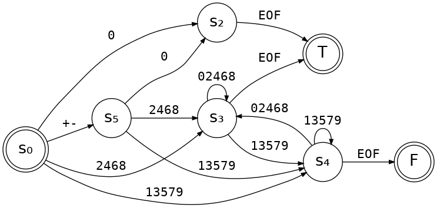

# An "is even" state machine

A state machine accepting one byte at a time to determine if a string
contains an even or odd integer (or neither). The initial state is zero.
Input is terminated with a zero byte, rendering a final result. Leading
zeros are invalid except for zero itself, and no whitespace is accepted. A
leading + or - sign is valid.

```c
// Returns the next state for most non-zero bytes, or the final result
// for a terminating zero byte. A result of -1 is an error (invalid
// input), 0 means odd, and 1 means even. Any other return value is a
// state (always positive).
int iseven(int state, int c);
```



Similar regex: `^[-+]?([1-9][0-9]*)?[0248]$`
